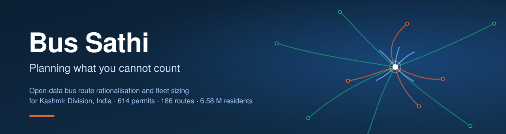
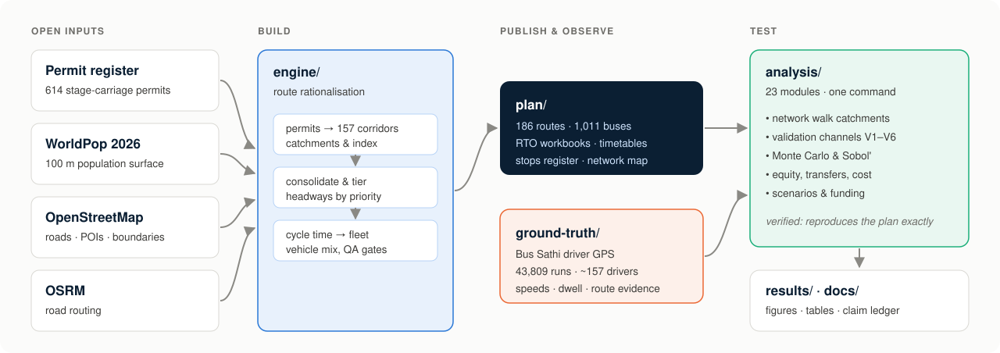

<p align="center">
  
</p>

<p align="center">
  <a href="LICENSE"></a>
  <a href="DATA_LICENSE.md"></a>
  
  <a href="../../actions/workflows/tests.yml"></a>
  <a href="CITATION.cff"></a>
</p>

<p align="center">
  <b>The code, data and results behind</b><br>
  <i>Planning What You Cannot Count: An Open-Data Framework for Bus Route Rationalisation and Fleet Sizing under Demand-Data Scarcity</i><br>
  (manuscript in preparation for <i>Transport Policy</i>)
</p>

---

## Why this exists

Most Indian cities that need bus-network reform have **no origin–destination or ridership data**. The
reform they most need — rationalising an inherited network of private stage-carriage permits — is exactly
the one their data least support.

This repository is a complete, reproducible answer for **Kashmir Division** (ten districts, 6.58 million
residents). It builds a route plan and fleet from **open data only** — a gridded population surface,
OpenStreetMap, a routing engine and the digitised permit register — and then does what plans of this kind
rarely do: **it tests its own numbers** against 43,809 driver-GPS runs, the one operator that publishes
data, satellite-derived building footprints, and a full uncertainty analysis. Every number reported is
produced by a module in this repository and traceable through a [claim ledger](docs/CLAIM_LEDGER.md).

## Key findings

| | Finding | Evidence |
|---|---|---|
| Permits | **A permit register is not a route register.** 614 permits describe only 157 corridors; the plan keeps 156 of them (99.4 %). The "71 % route reduction" is a change of unit. | [F1](docs/FINDINGS.md) · CL-01–08 |
| Coverage | **Straight-line catchments overstate who is served by a third.** Measured on the walking network, population served falls by a median **37.4 %** per route, and coverage from 35.5 % to **24.2 %** of residents. | CL-26–28 · [Fig. 6](results/figures/fig06_catchment_bias.png) |
| Run time | **Modelled buses are too fast.** Against 43,809 GPS runs, planned one-way time is a median 0.51 of observed; a per-km speed cap, not demand, sets cycle time on 169 of 186 routes. | CL-15–17, CL-31 |
| Fleet | **The fleet is a range, not a number.** 989–1,058 buses as specified, but **1,130–1,266 at observed pace** — above the published 1,011. The service hierarchy is robust (97.8 % of tiers unchanged). | CL-56–58 · [Fig. 9](results/figures/fig09_fleet_interval.png) |
| Funding | **Reach is cheap; frequency is expensive.** 30 % of the fleet, bought in the right order, reaches **92 %** of the plan's coverage. | CL-61 · [Fig. S2](results/figures/figS2_funding_curve.png) |
| Equity | **Access is unequal, and consolidation has named losers.** Accessibility Gini 0.90; 13,087 residents lose bus access when duplicate permits are merged. | CL-44–45 |

<p align="center">
  
  &nbsp;
  
</p>

## How it fits together

<p align="center">
  
</p>

## Repository map

| Folder | What is in it |
|---|---|
| [`plan/`](plan) | **The published plan (v3.4.5-geo):** 186 routes as CSV and GeoJSON, the RTO route-frequency workbooks, timetables, the stops register and the interactive network map. |
| [`engine/`](engine) | The rationalisation engine that produced the plan, with its preprocessing (geocoding, gazetteer) and post-processing (GPS-measured corrections, geometry fixes) steps. |
| [`ground-truth/`](ground-truth) | The pipeline that turns Bus Sathi driver GPS into measured speeds, dwell times and route evidence. Raw GPS is personal data and is **not** included; its aggregate outputs are. |
| [`analysis/`](analysis) | 23 modules that reproduce every number in the paper, run by one command (`run_all.py`). |
| [`data/`](data) | Frozen inputs (`raw/`), every module's output (`derived/`), and heavy caches (`cache/`, via Git LFS). Provenance and hashes in [`data/MANIFEST.md`](data/MANIFEST.md). |
| [`results/`](results) | All figures (PNG + vector PDF) and tables (CSV + Markdown). |
| [`docs/`](docs) | Method, data, validation, reproducibility and limitations — plus the claim ledger and findings. |
| [`tests/`](tests) | 60+ checks: exact reproduction of the published plan, scope rules, numerical invariants, secret scanning, and an end-to-end pipeline run. |

## Quick start

```bash
git clone https://github.com/Princu-Babu/Bus-sathi.git
cd Bus-sathi
git lfs pull                       # walk graph, catchments, population raster, building footprints

python -m venv .venv
source .venv/bin/activate          # Windows: .venv\Scripts\activate
pip install -r requirements.txt

python analysis/run_all.py --list  # the 23 modules and their state
python analysis/run_all.py --quick # reproduce every result (~8 minutes)
pytest -q                          # verify
```

`--quick` uses the cached walking network and catchments. To rebuild those from scratch (hours), see
[docs/05_reproducibility.md](docs/05_reproducibility.md). The engine itself needs an OSRM server and is
documented in [engine/README.md](engine/README.md).

## Validation at a glance

The plan is judged by six independent channels, each biased differently, so that agreement raises
confidence and disagreement localises a weakness. Results are reported as they came out.

| | Channel | Result |
|---|---|---|
| V1 | Population surface vs building footprints — *partly circular, disclosed* | **Passes** on 1.85 M Microsoft footprints (ρ 0.975 routes, 0.950 grid) |
| V2 | Operator benchmark (CHALO e-bus) — *circular, disclosed* | **Fails** the ±15 % band (ratio 1.29–1.58) |
| V3 | Expert weight elicitation | **Not conducted** — stated as future work |
| V4 | Driver GPS (supply side) | Geometry and moving speed pass; dwell and run time fail |
| V5 | Global sensitivity (Sobol') | Fleet driven by spare ratio and observed pace; tiers by the population weight |
| V6 | Decision robustness | Tiers pass (97.8 %); fleet only as a range |

**What this work does not claim.** The GPS carries no ridership signal, so nothing here is "validated
against demand". The honest claim is *decision-robustness of the supply plan*. See
[docs/06_limitations.md](docs/06_limitations.md).

## Data and licences

- **Code** — [GPL-3.0](LICENSE).
- **Data produced here** (derived tables, figures, the plan) — CC BY 4.0.
- **Third-party data** keep their own terms: OpenStreetMap and Microsoft building footprints (ODbL),
  WorldPop (CC BY 4.0), Census of India (open government data), ASRTU fleet handbook (public), CHALO/SSCL
  operating aggregates (published aggregates; see [DATA_LICENSE.md](DATA_LICENSE.md)).
- **Personal data** — raw driver GPS is never published. The one per-driver table used is released only
  in de-identified form ([tools/deidentify_driver_days.py](tools/deidentify_driver_days.py)).

## Citing

If you use this repository, please cite it using [CITATION.cff](CITATION.cff) (GitHub's *Cite this
repository* button produces BibTeX and APA). The manuscript citation will be added on publication.

## The wider Bus Sathi project

| Repository | Role |
|---|---|
| **Bus-sathi** (this) | Consolidated, citable code + data + results |
| [kashmir-transit-rationalisation](https://github.com/Princu-Babu/kashmir-transit-rationalisation) | Engine development history |
| [bus-sathi-trace-intelligence](https://github.com/Princu-Babu/bus-sathi-trace-intelligence) | GPS pipeline development history |
| [bus-sathi-paper](https://github.com/Princu-Babu/bus-sathi-paper) | Manuscript working repository |
| [bus-sathi-dashboard](https://github.com/GrostesqueChip/bus-sathi-dashboard) | Public dashboard for the plan |
| [Bus-Sathi app](https://github.com/krishaniitjammu/Bus-Sathi) | The driver app that produced the GPS |

## Acknowledgements

Built on OpenStreetMap contributors' data, WorldPop, Microsoft's Global ML Building Footprints and OSRM.
We thank the bus drivers who carried the Bus Sathi app. Full acknowledgements will follow the manuscript.

<sub>Every number on this page is produced by a module in <code>analysis/</code> and listed in the
<a href="docs/CLAIM_LEDGER.md">claim ledger</a>. If you find one that is not, please open an issue.</sub>
