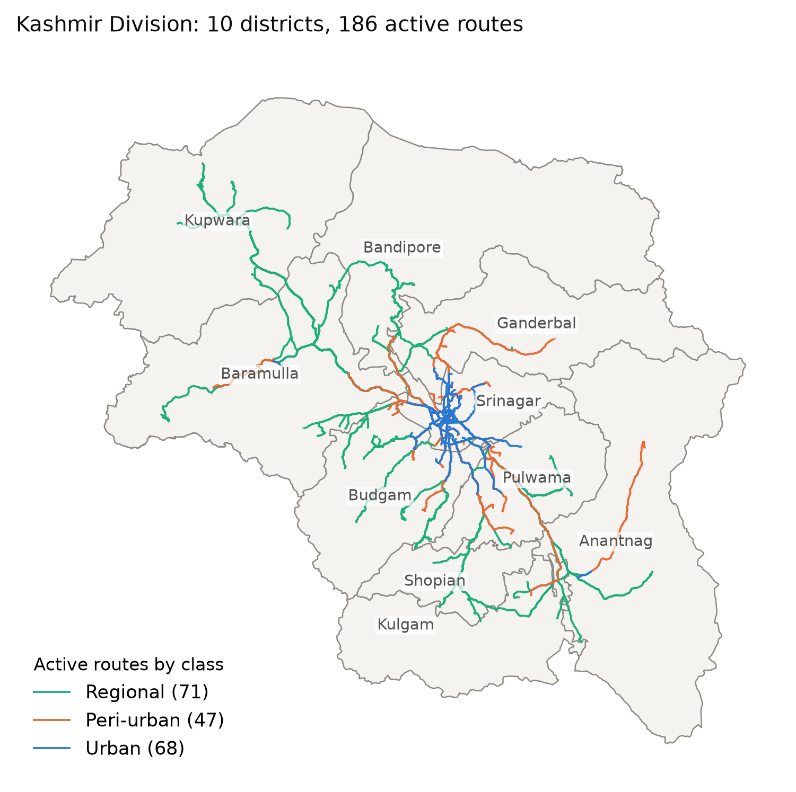
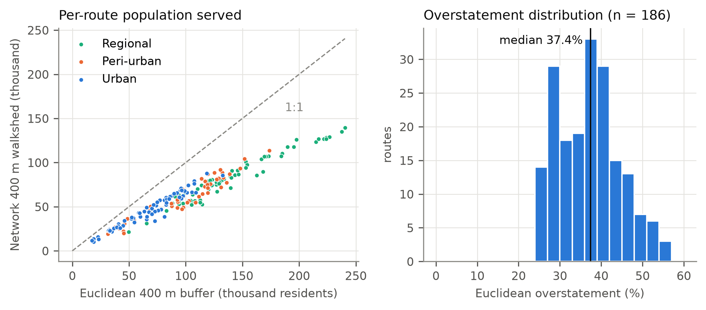
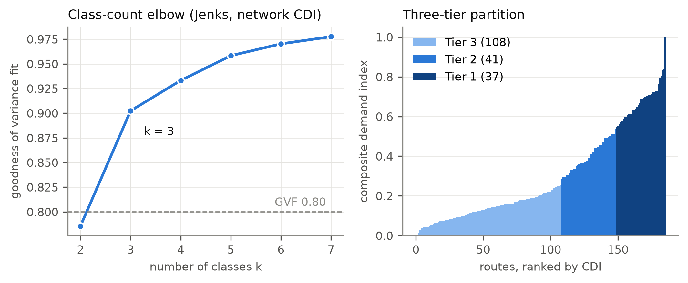
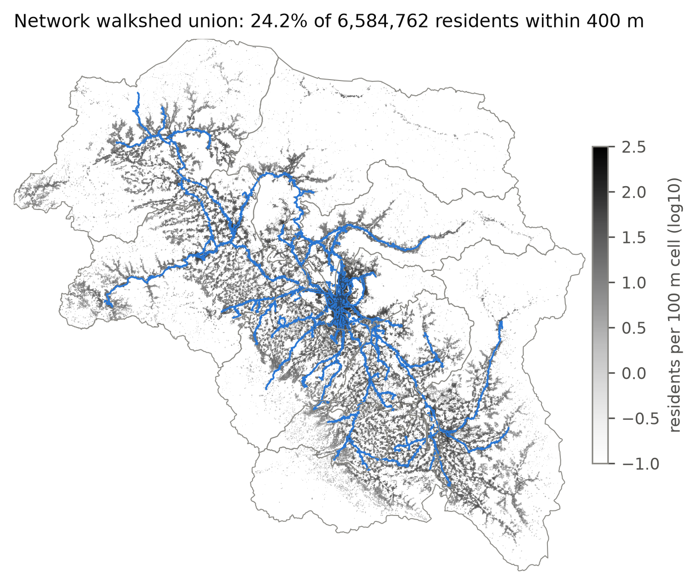
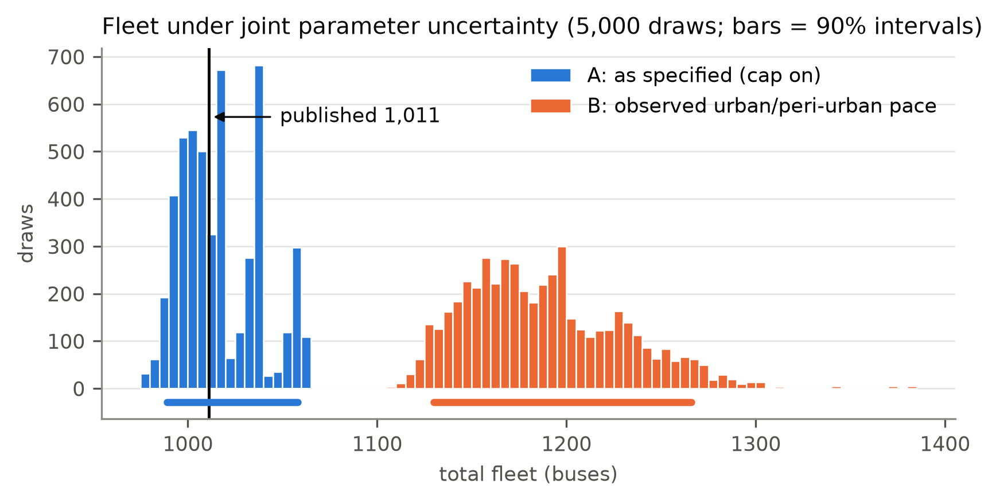
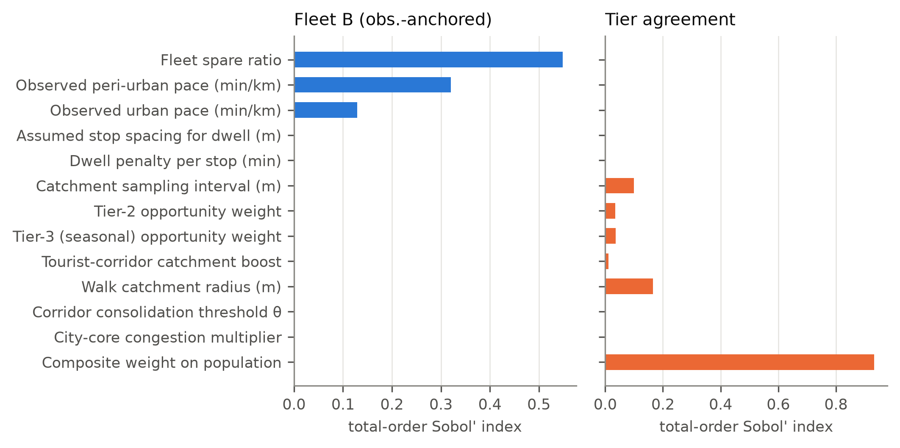
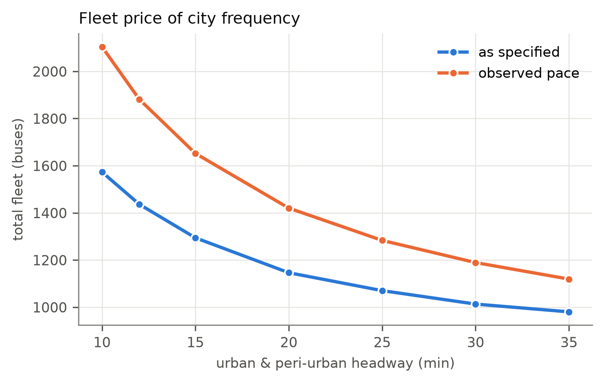
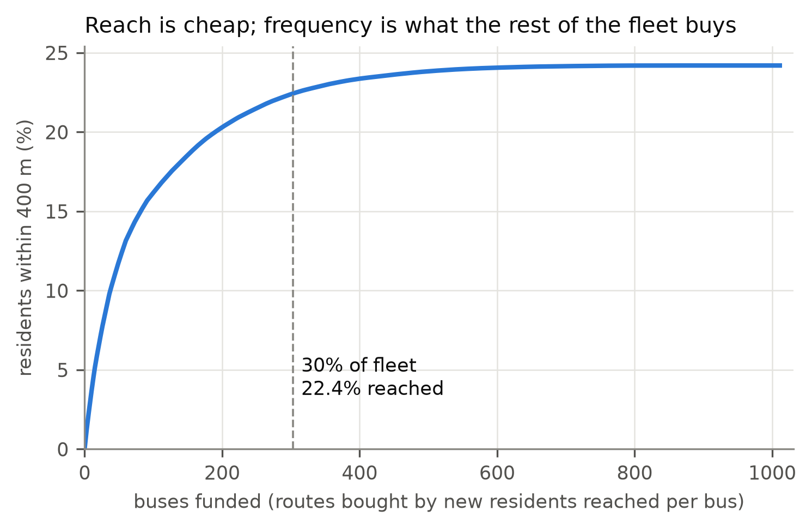
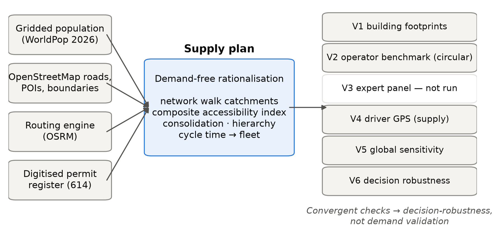
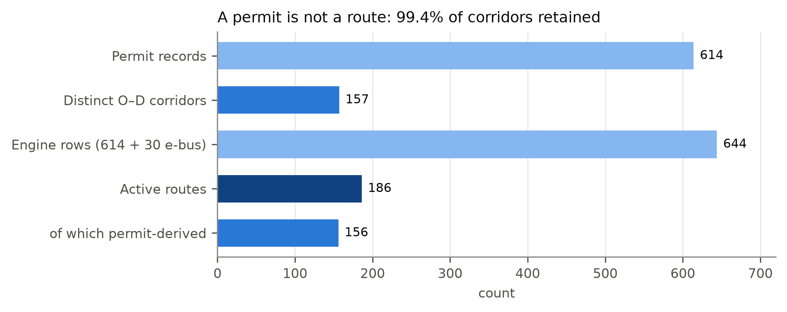

# results

Generated by `analysis/` — do not edit by hand. Figures are 300-dpi PNG plus vector PDF; tables are CSV
(machine-readable) plus Markdown (for reading on GitHub).

## Figures

| | |
|---|---|
|  **3** Study area and the 186 active routes |  **6** Straight-line vs network catchments |
|  **7** Class count and the three-tier hierarchy |  **8** Network walkshed over population |
|  **9** Fleet under joint uncertainty |  **9b** What drives the uncertainty |
|  **S1** The fleet price of frequency |  **S2** Reach per bus funded |
|  **1** Framework |  **5** Permits to routes |

## Tables

Tables are numbered as in the manuscript: `table02*` inputs and data quality · `table03*` catchments ·
`table04*` index weights · `table05*` results (tiers, network, coverage, equity, transfers, operations,
cost) · `table06*` validation · `table07*` sensitivity and uncertainty · `table08*` scenarios and funding.
